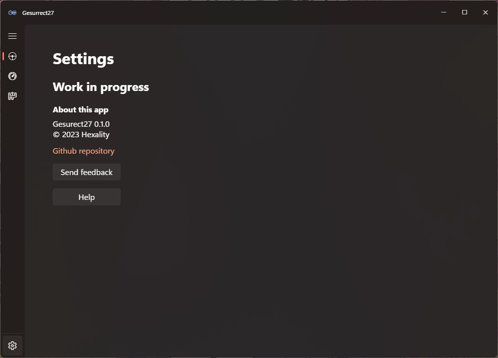

 
 

    

 

    <i>A Electron-based alternative software & driver for Logitech G27</i>
     
    <i><b>Note: The software is still WIP and doesn't really work</b></i>

 
 

    

 
 
 
 
<h2>This software relies components from the following sources</h2>
<a title="logitech-g27-node" href="https://github.com/nightmode/logitech-g27">logitech-g27-node</a>
 
<a title="electron" href="https://github.com/electron/electron">electron</a>
 
<a title="mica-electron" href="https://github.com/GregVido/mica-electron">mica-electron</a>
 
<a title="windows-accent-colors" href="https://github.com/xanderfrangos/windows-accent-colors">windows-accent-colors</a>
 
<a title="fluent-system-icons" href="https://github.com/microsoft/fluentui-system-icons">microsoft-fluent-system-icons</a>
 
 

First of all, huge thx to Josh who was the one who basically helped me back when I bought my wheel by sending his early-dev-but-working software called <a title="wheelie" href="https://github.com/joshcancode/wheelie-for-logitech-g27">wheelie</a>, which is the inspiration of this thing I'm trying to make.

and huge thanks to the respective devs for making such helpful components.

